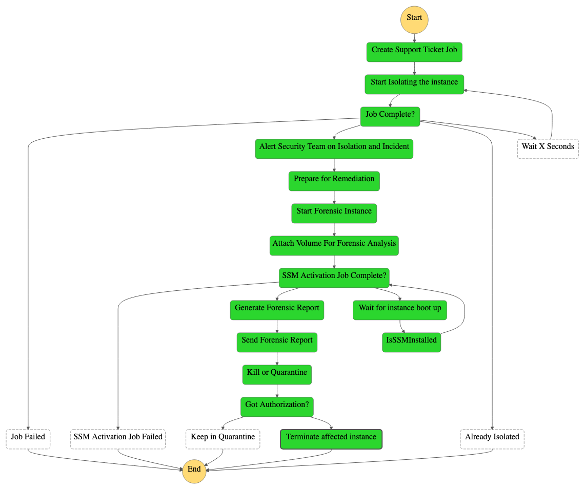

# EC2 Auto Clean Room Forensics

This example solution will take an instance ID from an SNS topic and through a series of AWS Lambda functions co-ordinated by AWS Step Functions will automatically notify, isolate and run basic forensics on the identified instance.
Please note: The instructions on how to create the forensics instance AMI will be published here soon.

# Overall Architecture 

# Pre-requisites

Download the git hub repo

Zip the lambda functions into a file and save the file in S3 bucket.

Edit the run commands in runForensicAnalysis.py - Update the S3 bucket details where EC2 instance launched is access.

Before running the cloud formation template, make sure you have teh following:
- EC2 key pair created on the desired region
- Have a valid Slack Hook, see [Slack API documentation](https://api.slack.com/messaging/webhooks#enable_webhooks)
- Create a Slack channel for notification delivery.
- Create a Security Group on the VPC that will be monitored, this security group will be used to place the instances
  in GuardDuty findings. This security group should have no allowed inbound or outbound rules other than a rule to allow
  the security team to connect to the affected instance for further analysis. 
- Either an SSM parameter store key storing the AMI ID to use for forensic purposes or the AMI ID to be used. By default,
  the cloud formation template use the public SSM parameter to get the latest Amazon Linux 2 AMI ID.
- Create a bucket to store the lambda functions in a zip file.
- Create a bucket to store the reports of the automated forensic tools (It can be the same bucket).
- Create an instance profile to allow management of the Forensic station with Systems Manager.

# Step 1 : Launch Cloud Formation Template - Incident-Response-Stepfunctions-lambda-vpc.json

The cloud formation template creates the following
1. Clean Room VPC
2. Lambda Functions - 

    sec-ir-1-createSupportTicket	Function to create support ticket	Python 3.6

    sec-ir-2-isolateInstance	Function to isolate Ec2 instance	Python 3.6

    sec-ir-3-sendIsolationNotification	Function to Send notification for instance Isolation and Snapshot creation	Python 3.6

    sec-ir-4-snapShotCreation	Function to isolate Ec2 instance	Python 3.6

    sec-ir-5-startForensicInstance	Function to Send notification for instance Isolation and Snapshot creation	Python 3.6

    sec-ir-6-createAndAttachAffectedVolume	Function to Create and attach volume created from Snapshot	Python 3.6

    sec-ir-7-isSSMInstalled	Function to Check SSM is installed or not	Python 3.6

    sec-ir-8-runForensicAnalysis	Function to Run Forensic Analysis	Python 3.6

    sec-ir-9-invokeStepFunctions	Function parse SNS message and invoke Step functions	Node.js 6.10
    
    Lambda Functions :
    SNSParserInvokeStep.py
    isolateInstance.py
    attachVolume.py			
    runForensicAnalysis.py
    createForensicInstance.py	
    sendForensicReport.py
    generateSupportTicket.py	
    sendIsolationNotification.py
    isSSMInstalled.py		
    snapshotForRemediation.py
 3. SNS Topic for posting Guard duty finding which will trigger sec-ir-9-invokeStepFunctions lambda function

# Step 2 Create Lambda functions which will be triggered for every S3 Create

SendErrorNotification.py
Create S3 trigger on the bucket which edited in the pre-requisites

# Step Functions Overview

***

Copyright 2018 Amazon.com, Inc. or its affiliates. All Rights Reserved.

Licensed under the Apache License, Version 2.0 (the "License"). You may not use this file except in compliance with the 
License. A copy of the License is located at

    http://aws.amazon.com/apache2.0/

or in the "license" file accompanying this file. This file is distributed on an "AS IS" BASIS, WITHOUT WARRANTIES OR 
CONDITIONS OF ANY KIND, either express or implied. See the License for the specific language governing permissions and 
limitations under the License.
